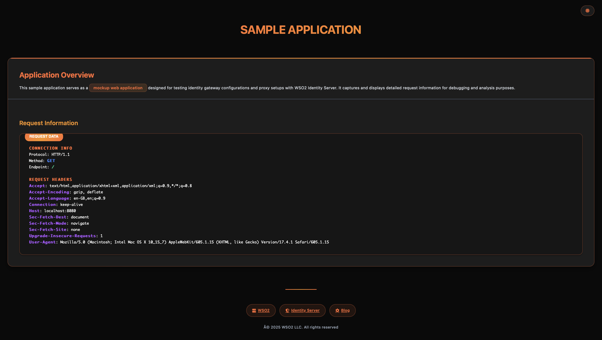

# Request Logger Sample App

A lightweight Java backend service built with [Spark Java](http://sparkjava.com/) designed for **WSO2 Identity Server** and **WSO2 Identity Gateway** documentation and testing purposes.



## Overview

The **Request Logger Sample App** is a mock backend service that captures and displays detailed information about incoming HTTP requests. It serves as an excellent tool for:

- Testing identity gateway configurations
- Debugging proxy setups
- Demonstrating authentication flows
- Learning HTTP request structures
- Development and testing environments

## ✨ Features

- **Request Logging**: Captures method, endpoint, headers, cookies, and connection details
- **Modern UI**: Responsive HTML interface with beautiful styling
- **Theme Toggle**: Light/dark mode switching for better user experience
- **Real-time Display**: Shows request information as it arrives
- **Portable**: Runs as a standalone service on port 8080
- **WSO2 Integration**: Designed specifically for WSO2 Identity Server workflows

## 🚀 Quick Start

### Prerequisites

- **Java**: 11 or higher
- **Maven**: 3.6 or higher
- **Git**: For cloning the repository

### Installation & Running

```bash
# Clone the repository
git clone https://github.com/wso2/samples-is.git
cd samples-is/identity-gateway/sample-request-logger-app

# Build the project
mvn clean package

# Run the application
mvn exec:java -Dexec.mainClass="org.example.RequestLogger"
```

### Alternative: Run from JAR

```bash
# Run the pre-built JAR file
java -jar target/request-logger-1.0-SNAPSSHOT-jar-with-dependencies.jar
```

## 🌐 Usage

Once the application is running:

1. **Access the app**: Navigate to `http://localhost:8080` in your browser
2. **Send requests**: Use any HTTP client (Postman, curl, browser) to send requests to the app
3. **View details**: The app will display comprehensive request information including:
   - HTTP method and endpoint
   - Request headers
   - Session cookies
   - Connection protocol details

### Example Request

```bash
curl -X POST http://localhost:8080/api/test \
  -H "Content-Type: application/json" \
  -H "Authorization: Bearer token123" \
  -d '{"message": "Hello World"}'
```

## 🏗️ Architecture

The application is built with a simple, lightweight architecture:

- **Framework**: Spark Java for HTTP handling
- **Port**: 8080 (configurable in code)
- **Response**: HTML with embedded CSS and JavaScript
- **Theme**: CSS variables for easy customization
- **Responsive**: Mobile-friendly design

## 📁 Project Structure

```
src/
├── main/
│   ├── java/
│   │   └── org/example/
│   │       └── RequestLogger.java    # Main application class
│   └── resources/
├── test/
└── pom.xml                          # Maven configuration
```

## 🔧 Configuration

### Port Configuration

The default port (8080) can be modified in the `RequestLogger.java` file:

```java
public static void main(String[] args) {
    port(8080);  // Change this value as needed
    // ... rest of the code
}
```

### Build Configuration

The project uses Maven with the following key plugins:

- **maven-compiler-plugin**: Java 11 compilation
- **maven-assembly-plugin**: Creates executable JAR with dependencies

## 🎨 UI Features

### Theme System
- **Dark Mode**: Default theme with dark backgrounds and light text
- **Light Mode**: Alternative theme with light backgrounds and dark text
- **Toggle Button**: Floating button in the top-right corner
- **Smooth Transitions**: CSS animations for theme switching

### Responsive Design
- Mobile-friendly layout
- Adaptive typography
- Flexible card system
- Touch-friendly interface elements

## 📦 Dependencies

| Dependency | Version | Purpose |
|------------|---------|---------|
| `spark-core` | 2.9.4 | HTTP framework |
| `slf4j-simple` | 1.7.36 | Logging framework |

## 🚀 Deployment

### Local Development
```bash
mvn spring-boot:run
```

### Production Build
```bash
mvn clean package
```

### Docker (if needed)
```dockerfile
FROM openjdk:11-jre-slim
COPY target/request-logger-1.0-SNAPSHOT-jar-with-dependencies.jar app.jar
EXPOSE 8080
CMD ["java", "-jar", "app.jar"]
```

## 🔍 Troubleshooting

### Common Issues

1. **Port Already in Use**
   ```bash
   # Check what's using port 8080
   lsof -i :8080
   
   # Kill the process or change the port in code
   ```

2. **Java Version Issues**
   ```bash
   # Verify Java version
   java -version
   
   # Should show Java 11 or higher
   ```

3. **Maven Build Failures**
   ```bash
   # Clean and rebuild
   mvn clean package -U
   ```

## 🤝 Contributing

1. Fork the repository
2. Create a feature branch
3. Make your changes
4. Add tests if applicable
5. Submit a pull request

## 📄 License

This project is licensed under the [Apache License 2.0](LICENSE).

## 🔗 Related Links

- [WSO2 Identity Server](https://wso2.com/identity-server/)
- [WSO2 Identity Gateway](https://wso2.com/identity-gateway/)
- [Spark Java Framework](http://sparkjava.com/)
- [WSO2 Samples Repository](https://github.com/wso2/samples-is)

## 📞 Support

For support and questions:
- [WSO2 Documentation](https://docs.wso2.com/)
- [WSO2 Community](https://wso2.com/community/)
- [GitHub Issues](https://github.com/wso2/samples-is/issues)

---

**Note**: This application is designed for development, testing, and demonstration purposes. It should not be used in production environments without proper security considerations.
